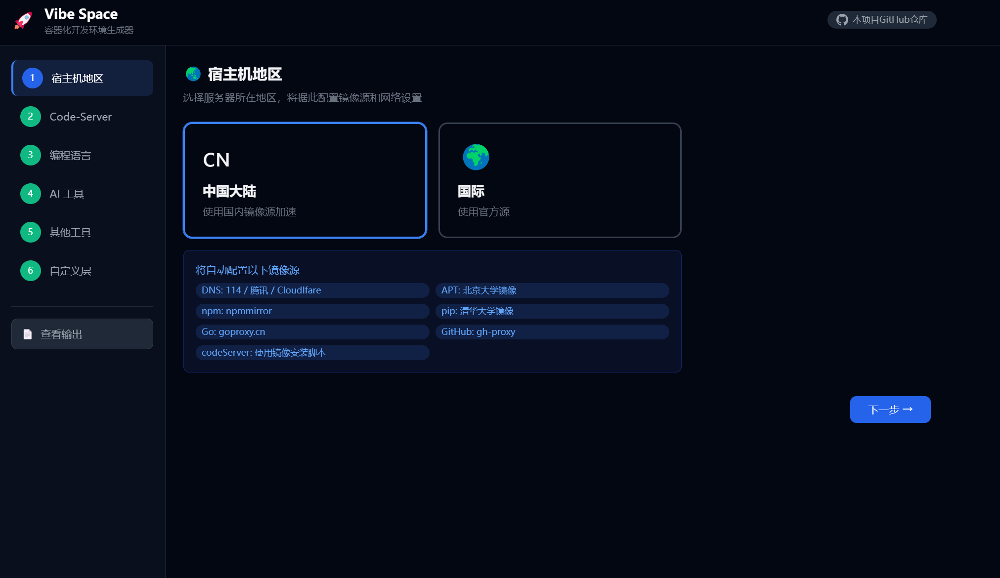
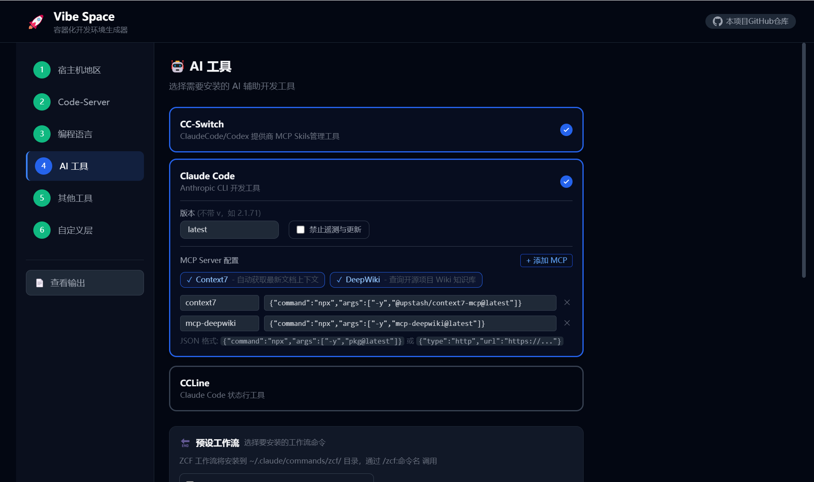
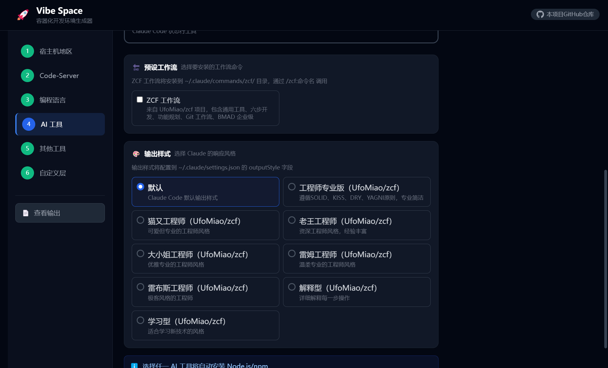
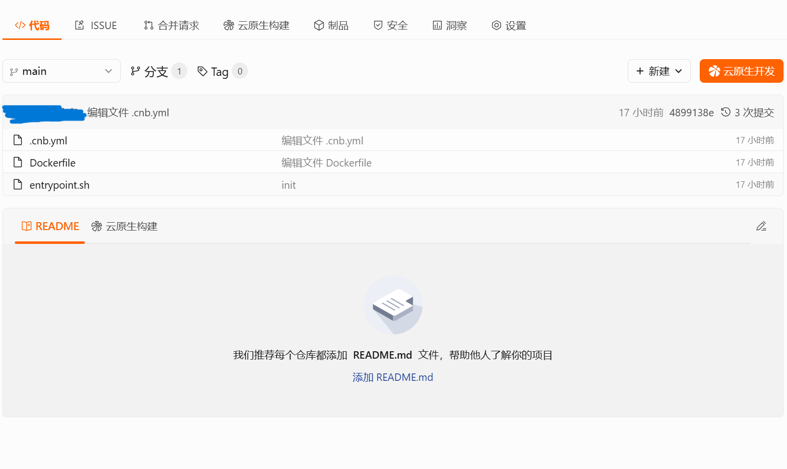

# 🚀 Vibe Space

**VibeSoace** — 通过可视化向导，根据你的开发技术栈，选择配置好Skills，MCP，Agent的AI开发工具，一键生成生产可用的安全的容器化Vibe开发环境，支持ClaudeCode，Roo，不再一直需要“回车以允许” ，无需担心AI工具损坏操作系统，内置工作流（也可自定义），无需再为Skills，MCP等技术的快速更新而困扰，放心的Vibe Coding！

## 功能特性

- **向导配置** — 地区选择、Code-Server、编程语言、AI 工具、附加工具、自定义层，逐步引导完成配置
- **区域感知** — 自动配置国内镜像源（apt / npm / pip / Go / GitHub proxy），解决网络问题
- **多语言支持** — Go、Node.js、Python、Rust、Java、C、C++，支持版本选择与自定义版本号
- **AI 工具集成** — Claude Code、CCLine、CC-Switch，支持 MCP Server 配置和 ZCF 工作流预设
- **双访问模式** — SSH + 浏览器端 Code-Server (VS Code)，灵活选择开发方式
- **实时预览** — 配置变更即时反映到生成结果，所见即所得
- **一键导出** — 打包下载 Dockerfile、docker-compose.yml、entrypoint.sh、deploy.sh 四个文件的 ZIP

## 界面预览







## 快速开始

### 使用方法

通过以下任一方法，进入VibeSpace DIY 页面，根据自己的喜好，选择语言环境，AI工具，Workflow，CC-Switch等工具，生成可一键执行的部署脚本，或部署到CNB ,Github CodeSpace 等

方法1：使用已部署的在线页面 [点击此处进入 Vibe Space DIY](https://vibespace.xyzen.de/)

方法2： [点此下载本项目压缩包](https://codeload.github.com/XyzenSun/vibespace/zip/refs/heads/main) ，解压后打开 index.html 在本地浏览器中操作

方法3 ： Clone 本项目，打开 index.html 在本地浏览器中操作

### 部署到云平台（CNB / CodeSpace 等）

#### CNB：
[CNB](https://cnb.cool/) 平台提供每月免费1600核时的云开发环境时长，足够每天使用8小时6核心12G内存的VibeSpace
部署方法为：在CNB平台新建一个仓库，将生成的Dockerfile，entrypoint.sh，.cnb.yml 上传到仓库根目录，点击云原生开发即可，CNB平台暂不支持`environment`
 
### 部署到自有机器

```bash
# 解压并执行部署脚本
unzip devbox-config.zip -d devbox && cd devbox
chmod +x deploy.sh entrypoint.sh
./deploy.sh

# 按提示编辑环境变量后启动
docker compose up -d
```

### 常用命令

```bash
docker compose up -d          # 启动容器
docker compose down           # 停止容器
docker compose logs -f        # 查看日志
docker compose up -d --build  # 重新构建并启动
docker exec -it devbox bash   # 进入容器
```

## 生成的文件说明

| 文件 | 说明 |
|------|------|
| `Dockerfile` | 多层优化的镜像构建文件，按变更频率分层以利用构建缓存 |
| `docker-compose.yml` | 容器编排配置，包含端口映射、数据持久化、环境变量 |
| `entrypoint.sh` | 容器启动脚本，运行时配置 Git、SSH 密钥、密码、生成 README |
| `deploy.sh` | 一键部署辅助脚本，检查环境并构建镜像 |

## 配置项详解

### 步骤 1：宿主机地区

| 选项 | 说明 |
|------|------|
| 中国大陆 | 自动配置 DNS、APT（北大镜像）、npm（npmmirror）、pip（清华）、Go（goproxy.cn）、GitHub（gh-proxy）、CodeServer镜像源下载|
| 国际 | 使用官方源 |

### 步骤 2：Code-Server

- 启用后可通过浏览器访问 VS Code（默认端口 8080）
- 12 个常用预置扩展可选，支持自定义扩展
- 配置 SSH root 密码和 SSH 密钥对，通过SSH连接到容器开发以及使用git

### 步骤 3：编程语言

支持 7 种语言，每种可选版本：

- **Go** — 官方二进制包安装，附带 gopls / dlv / staticcheck
- **Node.js** — NodeSource 安装，附带 TypeScript / ts-node
- **Python** — 系统版本或通过 deadsnakes PPA 指定版本，可选 venv
- **Rust** — 通过rustup 安装最新稳定版
- **Java** — OpenJDK，支持 8 / 11 / 17 / 21
- **C / C++** — GCC / G++，支持指定编译器版本

### 步骤 4：AI 工具

- **CC-Switch** — Claude Code / Codex 提供商管理工具
- **Claude Code** — Anthropic CLI 开发工具，支持版本选择、遥测开关
  - **MCP Server** — 预设 Context7、DeepWiki，或自定义 JSON 配置
  - **ZCF 工作流** — 通用工具、六步开发、功能规划、Git 工作流、BMAD 企业级
  - **输出样式** — 默认、工程师专业版、猫又、老王、大小姐、雷姆、雷布斯等风格
- **CCLine** — Claude Code 状态行工具（依赖 Claude Code）

### 步骤 5：其他工具

- **Cloudflare Tunnel** — 内网穿透（通过环境变量传入 Token）
- **Vibe 快捷命令** — 自定义 `vibe` 别名，一键进入AI工具的特权模式，在VibeSpace中无需担心AI工具损坏系统
- **数据持久化** — Docker 卷挂载 或 目录挂载

### 步骤 6：自定义层

在 AI 工具层之后、SSH 配置之前插入自定义 Dockerfile 指令（RUN / COPY / ENV 等）。

## 环境变量

| 变量 | 说明 | 默认值 |
|------|------|--------|
| `ROOT_PASSWORD` | SSH root 密码 | `root123` |
| `GIT_USER_NAME` | Git 用户名 | — |
| `GIT_USER_EMAIL` | Git 邮箱 | — |
| `SSH_PRIVATE_KEY` | SSH 私钥 | — |
| `SSH_PUBLIC_KEY` | SSH 公钥 | — |
| `CS_PASSWORD` | Code-Server 密码（不设置则免密）| — |
| `CF_TUNNEL_TOKEN` | Cloudflare Tunnel Token | — |

## 项目结构

```
├── index.html                 # 主页面（向导 UI）
├── css/style.css              # 暗色主题样式
├── js/
│   ├── data/
│   │   ├── urls.js            # 全局远程资源 URL 注册表
│   │   └── defaults.js        # 配置常量（语言、工具、预设）
│   ├── generators/
│   │   ├── dockerfile.js      # Dockerfile 生成器
│   │   ├── compose.js         # docker-compose.yml 生成器
│   │   ├── entrypoint.js      # entrypoint.sh 生成器
│   │   └── deploy.js          # deploy.sh 生成器
│   ├── utils/
│   │   ├── download.js        # 文件下载 & ZIP 打包
│   │   └── highlight.js       # 语法高亮
│   └── app.js                 # Alpine.js 应用状态
└── build-test/                # CI 构建测试用的全量配置
```

## 技术栈

- [Alpine.js](https://alpinejs.dev/) — 轻量级响应式框架
- [Tailwind CSS](https://tailwindcss.com/) — 原子化 CSS
- [Prism.js](https://prismjs.com/) — 语法高亮
- [JSZip](https://stuk.github.io/jszip/) — 客户端 ZIP 生成

纯静态页面，无需构建工具，无后端依赖。

## 开发计划
- 提供更多AI工具如Codex，Gemini CLI，OpenCode的预设配置
- 提供终端工具，在终端中使用VibeSpace
- 融入Happy等远程vibe coding工具
- 支持部署到HuggingFace，魔搭创空间并支持数据持久化
- 预设更多语法的开发工具链
- 增加前后端集成版本，彻底的一键部署
- 为本项目制作Skill，通过AI对话，快速部署

## License

MIT
